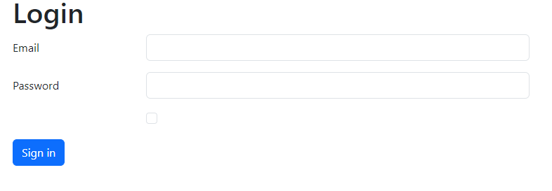

# Projeto - Tela de Login

## DESCRIÇÃO
O projeto de tela de login é um acesso a sua identidade é encontrado em diversos tipos de website, como, uns exemplos: Redes sociais, email e sites de ecommerce.

## TECNOLOGIA UTILIZADAS

| Tecnologia    | Versão    |
|---------------|-----------|
| HTML          |   5       |
| CSS           |   3       |
| BOOTRSTRAP    |   5       |
| GITHUB        |   X       |
| GIT           |   2.37    |

## FERRAMENTAS UTILIZADAS

* VSCODE
* LIVE SERVER
* GIT BASH 

## FONTES DE CONSULTAS
[contruindo tabela no README](https://docs.github.com/pt/get-started/writing-on-github/working-with-advanced-formatting/organizing-information-with-tables)

